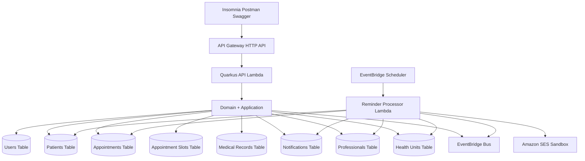
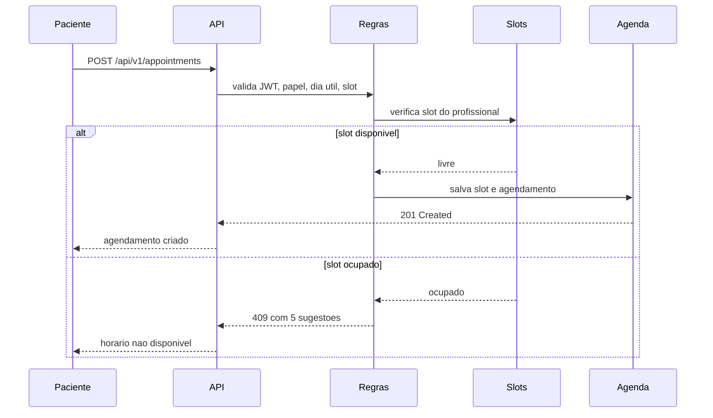
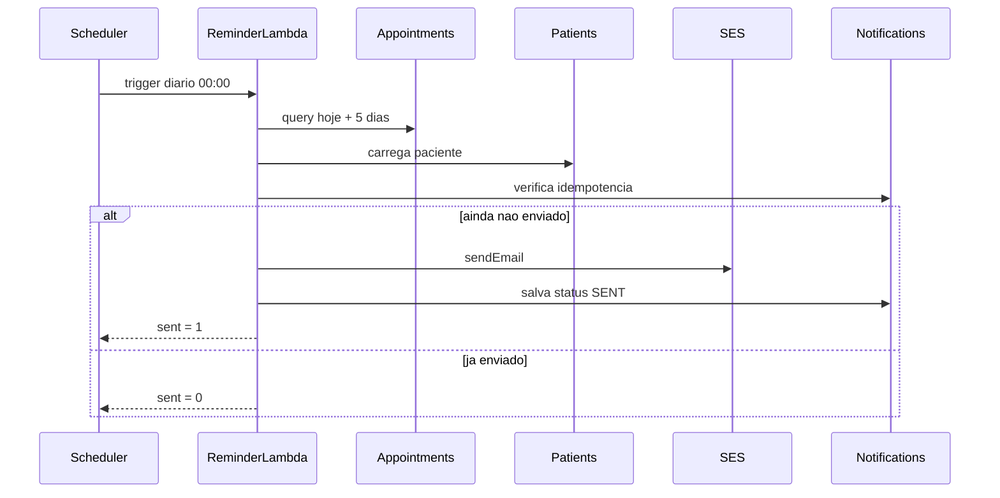
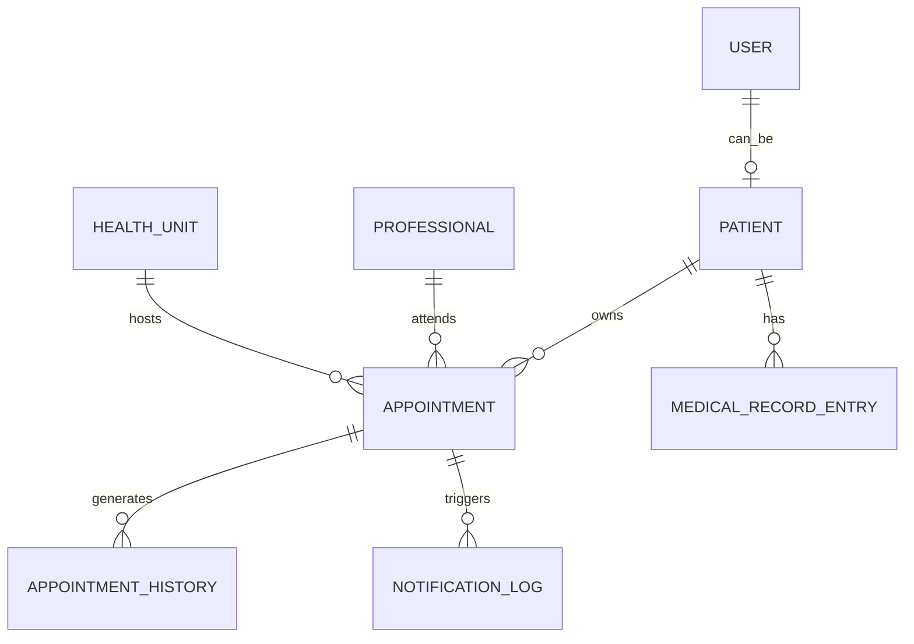

# SUS Agenda+

MVP backend para otimizacao do atendimento no SUS, com foco em agendamento de consultas e exames, prontuario evolutivo, autenticacao por perfil e lembretes automaticos.

## Status atual

- backend implantado em AWS na conta `141927125813`, regiao `us-east-1`;
- API REST publicada via API Gateway + Lambda + Quarkus;
- persistencia principal em DynamoDB;
- lembrete assincrono validado com Lambda dedicada + Scheduler + SES sandbox;
- autenticacao JWT e RBAC basico implementados;
- testes locais passando.

API validada em `dev`:

- `https://f2613iafw4.execute-api.us-east-1.amazonaws.com`

## Resumo executivo

O SUS Agenda+ resolve uma dor concreta do sistema publico de saude: dificuldade para organizar agendamentos, reagendamentos, historico clinico e comunicacao com o paciente. A solucao centraliza fluxos de cadastro, autenticacao, agendamento, consulta de disponibilidade, historico de agendamento, prontuario evolutivo e lembretes automaticos.

O projeto foi construido como MVP academico, sem front-end obrigatorio, com enfase em arquitetura, regras de negocio, integracao cloud, testes e capacidade de demonstracao tecnica.

## Aderencia ao hackathon

| Criterio do desafio | Situacao | Evidencia |
|---|---|---|
| Tema: inovacao para otimizacao do atendimento no SUS | Atendido | Solucao focada em agendamento, prontuario e lembretes. |
| MVP de back-end e arquitetura | Atendido | API REST, Lambdas, DynamoDB, EventBridge e Scheduler. |
| Demonstracao da viabilidade | Atendido | E2E HTTP validado em AWS e fluxo assincrono de lembrete validado. |
| Problema e impacto | Atendido parcialmente | Problema esta claro; metricas de impacto ainda podem ser ampliadas no pitch. |
| Funcionalidade do MVP | Atendido | Fluxo principal e lembretes validados. |
| Documentacao | Atendido | README final, OpenAPI habilitada e materiais locais de apoio. |

## Criterios de aceite

### Tecnicos

- API REST funcional localmente e em AWS: atendido.
- autenticacao JWT ativa: atendido.
- autorizacao por papel e recurso nos endpoints implementados: atendido para os endpoints atuais.
- publicacao e consumo de fluxo assincrono de lembretes: atendido.
- build, testes e deploy automatizaveis: atendido.

### Funcionais

- paciente consegue cadastrar usuario, autenticar e criar proprio cadastro: atendido.
- paciente consegue criar agendamento: atendido.
- conflito de agenda devolve `409` com alternativas: atendido.
- prontuario evolutivo registra entradas sem edicao: atendido.
- lembrete automatico e processado e persistido: atendido.

### De apresentacao

- solucao demonstravel por API: atendido.
- arquitetura clara e cloud-native: atendido.
- roteiro de pitch e material de apoio: ver arquivo local `pitch_video.md`.

## Resultados de validacao

### Testes locais

Ultima execucao validada:

```text
Tests run: 17
Failures: 0
Errors: 0
BUILD SUCCESS
```

Cobertura validada pelos testes:

- cadastro publico de paciente;
- bloqueio de cadastro publico para papel medico;
- login e emissao de JWT;
- consulta e cadastro de paciente;
- agendamento com regras de dias uteis e horarios;
- conflito com cinco sugestoes;
- bloqueio de agendamento para outro paciente;
- prontuario append-only;
- bloqueio de escrita de prontuario por paciente;
- processamento idempotente de lembrete.

### E2E AWS

Fluxo HTTP validado na AWS:

```json
{
  "UserId": "48c49b00-917f-41b1-90bc-6453542cf2df",
  "PatientId": "48c49b00-917f-41b1-90bc-6453542cf2df",
  "AppointmentId": "453e1aa4-07ef-40a2-afae-50998293fe36",
  "ConflictStatus": 409,
  "BaseUrl": "https://f2613iafw4.execute-api.us-east-1.amazonaws.com"
}
```

Fluxo assincrono de lembrete validado na AWS:

```json
{"status":"processed","sent":1}
```

Reexecucao idempotente do lembrete:

```json
{"status":"processed","sent":0}
```

Persistencia do lembrete em DynamoDB:

```json
{
  "notificationId": "appointment-reminder-validation|2026-09-12",
  "appointmentId": "appointment-reminder-validation",
  "status": "SENT"
}
```

## Arquitetura

### Visao de componentes



### Fluxo de agendamento



### Fluxo de lembrete



### Modelo logico simplificado



## Stack e implantacao

- Java 21
- Quarkus 3.17.7
- Maven
- AWS Lambda
- AWS SAM / CloudFormation
- API Gateway HTTP API
- DynamoDB
- EventBridge
- EventBridge Scheduler
- Amazon SES sandbox
- GitHub Actions com OIDC

Conta e ambiente atualmente validados:

- conta AWS: `141927125813`
- stage: `dev`
- regiao: `us-east-1`
- repositorio GitHub: `israelbarberino/fiap-hackaton`

## Swagger e OpenAPI

OpenAPI esta habilitado no projeto.

Referencias:

- documento OpenAPI local: `/openapi`
- Swagger UI local do Quarkus: `/q/swagger-ui`
- colecao Postman local completa: arquivo local `postman/sus-agenda.full.postman_collection.json`

## Catalogo de endpoints

### Autenticacao

#### POST /api/v1/auth/register

Uso: cadastro publico apenas para pacientes.

Exemplo de request:

```json
{
  "name": "Maria da Silva",
  "cpf": "12345678901",
  "email": "maria@susmvp.com.br",
  "password": "SenhaSegura123",
  "role": "PATIENT"
}
```

Exemplo de response `201`:

```json
{
  "id": "user-id",
  "name": "Maria da Silva",
  "email": "maria@susmvp.com.br",
  "role": "PATIENT"
}
```

Erro esperado `403`:

```json
{
  "code": "PUBLIC_REGISTRATION_FORBIDDEN",
  "message": "Cadastro publico disponivel apenas para pacientes."
}
```

#### POST /api/v1/auth/login

Request:

```json
{
  "login": "maria@susmvp.com.br",
  "password": "SenhaSegura123"
}
```

Response `200`:

```json
{
  "accessToken": "jwt-token",
  "tokenType": "Bearer"
}
```

Erro `401`:

```json
{
  "code": "INVALID_CREDENTIALS",
  "message": "Credenciais invalidas."
}
```

### Pacientes

#### POST /api/v1/patients

Request:

```json
{
  "name": "Maria da Silva",
  "cpf": "12345678901",
  "email": "maria@susmvp.com.br",
  "phone": "11999999999",
  "address": "Rua A, 10",
  "whatsappEnabled": false
}
```

Response `201`:

```json
{
  "id": "patient-id",
  "name": "Maria da Silva",
  "cpf": "12345678901",
  "email": "maria@susmvp.com.br",
  "phone": "11999999999",
  "address": "Rua A, 10",
  "whatsappEnabled": false
}
```

Erro `409`:

```json
{
  "code": "PATIENT_ALREADY_EXISTS",
  "message": "Ja existe paciente com este CPF."
}
```

#### GET /api/v1/patients/{id}

Response `200`:

```json
{
  "id": "patient-id",
  "name": "Maria da Silva",
  "cpf": "12345678901",
  "email": "maria@susmvp.com.br"
}
```

Erro `403`:

```json
{
  "code": "FORBIDDEN",
  "message": "Voce nao tem permissao para consultar este paciente."
}
```

### Agendamentos

#### GET /api/v1/appointments/availability

Exemplo:

`/api/v1/appointments/availability?professionalId=doctor-api-1&unitId=unit-api-1&date=2026-09-08&time=08:00`

Response `200`:

```json
[
  { "date": "2026-09-08", "startTime": "09:00:00" },
  { "date": "2026-09-08", "startTime": "10:00:00" },
  { "date": "2026-09-08", "startTime": "11:00:00" },
  { "date": "2026-09-08", "startTime": "12:00:00" },
  { "date": "2026-09-08", "startTime": "13:00:00" }
]
```

#### POST /api/v1/appointments

Request:

```json
{
  "patientId": "patient-id",
  "professionalId": "doctor-api-1",
  "unitId": "unit-api-1",
  "type": "CONSULTA",
  "date": "2026-09-08",
  "time": "08:00"
}
```

Response `201`:

```json
{
  "id": "appointment-id",
  "patientId": "patient-id",
  "professionalId": "doctor-api-1",
  "unitId": "unit-api-1",
  "type": "CONSULTA",
  "date": "2026-09-08",
  "time": "08:00:00",
  "status": "AGENDADO"
}
```

Erro `409`:

```json
{
  "code": "APPOINTMENT_TIME_UNAVAILABLE",
  "message": "Horario nao disponivel.",
  "suggestedSlots": [
    { "date": "2026-09-08", "startTime": "09:00:00" },
    { "date": "2026-09-08", "startTime": "10:00:00" },
    { "date": "2026-09-08", "startTime": "11:00:00" },
    { "date": "2026-09-08", "startTime": "12:00:00" },
    { "date": "2026-09-08", "startTime": "13:00:00" }
  ]
}
```

Erro `403`:

```json
{
  "code": "FORBIDDEN",
  "message": "Voce nao pode agendar para este paciente."
}
```

Erro `400`:

```json
{
  "code": "APPOINTMENT_ON_NON_BUSINESS_DAY",
  "message": "Agendamentos so podem ocorrer em dias uteis."
}
```

#### GET /api/v1/appointments/{id}

Response `200`: retorna o agendamento.

Erro `403`: usuario sem vinculo com o paciente.

#### PUT /api/v1/appointments/{id}/reschedule

Request:

```json
{
  "date": "2026-09-09",
  "time": "09:00"
}
```

Response `200`: retorna o agendamento atualizado com `status = REAGENDADO`.

#### PATCH /api/v1/appointments/{id}/cancel

Request:

```json
{
  "reason": "Paciente solicitou cancelamento"
}
```

Response `200`: retorna o agendamento com `status = CANCELADO`.

#### GET /api/v1/appointments/{id}/history

Response `200`: lista de historico do agendamento.

### Prontuario

#### POST /api/v1/patients/{patientId}/medical-record/entries

Request:

```json
{
  "professionalId": "doctor-api-1",
  "appointmentId": "appointment-id",
  "evolutionType": "CONSULTA",
  "description": "Paciente em bom estado geral.",
  "observations": "Manter acompanhamento."
}
```

Response `201`:

```json
{
  "entryId": "entry-id",
  "patientId": "patient-id",
  "professionalId": "doctor-api-1",
  "appointmentId": "appointment-id",
  "evolutionType": "CONSULTA",
  "description": "Paciente em bom estado geral.",
  "observations": "Manter acompanhamento."
}
```

Erro `403`:

```json
{
  "code": "FORBIDDEN",
  "message": "Somente medicos ou administradores podem registrar evolucao."
}
```

#### GET /api/v1/patients/{patientId}/medical-record/history

Response `200`: lista de entradas do prontuario.

### Notificacoes

#### POST /api/v1/notifications/process-reminders

Uso operacional para teste local ou invocacao controlada.

Response `200`:

```json
{
  "sent": 1
}
```

## Massas de teste

### Usuarios e perfis usados nos cenarios

- paciente de teste: cadastro publico via `/api/v1/auth/register`;
- profissional de teste local: `doctor-api-1`, `doctor-api-2`, `doctor-e2e`;
- unidade local: `unit-api-1`, `unit-api-2`, `unit-e2e`;
- paciente de lembrete AWS: `patient-reminder-validation`;
- agendamento de lembrete AWS: `appointment-reminder-validation`.

### Massa seeded na AWS para lembrete

Profissional:

```json
{
  "professionalId": "doctor-e2e",
  "name": "Dra. Marina Souza",
  "specialty": "Clinica Geral",
  "unitId": "unit-e2e",
  "active": true
}
```

Unidade:

```json
{
  "unitId": "unit-e2e",
  "name": "UBS Centro",
  "neighborhood": "Centro",
  "city": "Sao Paulo",
  "state": "SP",
  "active": true
}
```

## Regras de negocio implementadas

- agendamentos apenas em dias uteis;
- janela de atendimento entre 07:00 e 20:00;
- slots fixos de uma hora;
- bloqueio de horarios passados;
- conflito retorna cinco alternativas;
- paciente so agenda para si mesmo;
- cadastro publico restrito a pacientes;
- prontuario e append-only;
- lembretes sao idempotentes;
- ambiente AWS usa OIDC no GitHub Actions.

## Limitacoes conhecidas do MVP

- SES ainda esta em sandbox;
- historico de agendamento ainda precisa persistencia dedicada em DynamoDB;
- reagendamento ainda precisa transacao completa de liberacao do slot anterior;
- RBAC foi implementado nos endpoints atuais, mas pode ser refinado conforme expansao do dominio;
- alarmes CloudWatch, DLQ e retencao de logs ainda nao foram fechados.

## Como executar localmente

```bash
mvn test
mvn quarkus:dev
```

Dependencias locais opcionais:

```bash
docker compose up -d
```

## Como implantar

OIDC GitHub Actions ja configurado.

Deploy manual validado:

```bash
sam validate --template-file template.yaml --lint
mvn package -DskipTests
sam deploy --template-file template.yaml --stack-name sus-agenda-dev --capabilities CAPABILITY_IAM --resolve-s3 --no-confirm-changeset --no-fail-on-empty-changeset --parameter-overrides ParameterKey=Stage,ParameterValue=dev ParameterKey=JwtSecret,ParameterValue=*** ParameterKey=NotificationSenderMode,ParameterValue=ses ParameterKey=SesFromEmail,ParameterValue=***
```

## Entregaveis locais de apoio

Materiais mantidos apenas localmente:

- colecao Postman completa;
- roteiro de pitch em `pitch_video.md`;
- relatorio de pendencias em `pendencias_1.md`;
- scripts de seed e validacao AWS.

## Conclusao

O projeto esta funcional como MVP tecnico de hackathon, com backend implantado, fluxo principal validado em AWS, protecao de autenticacao e autorizacao nos endpoints implementados, e processamento assincrono de lembretes comprovado.
